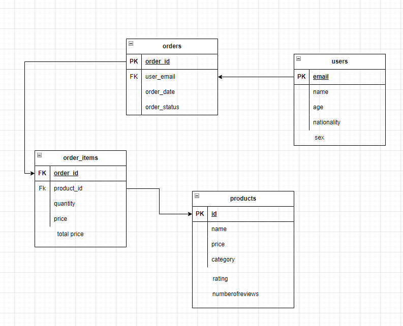
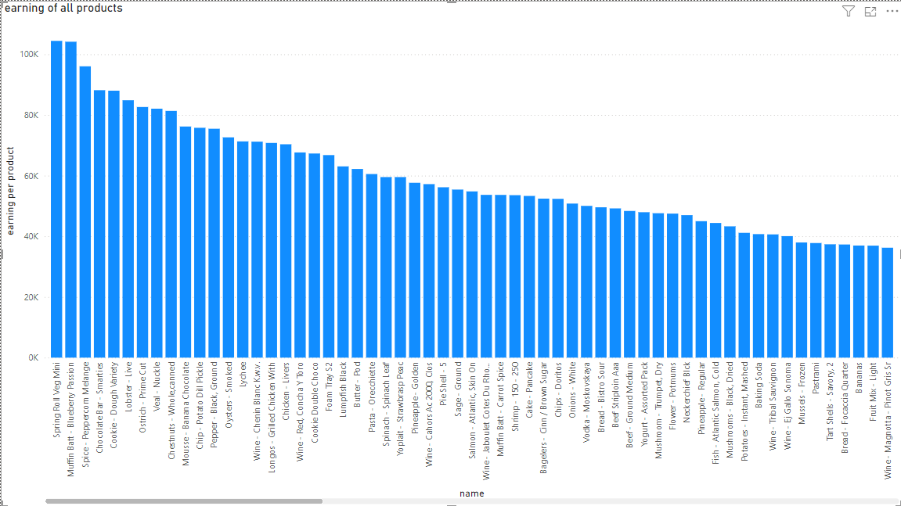
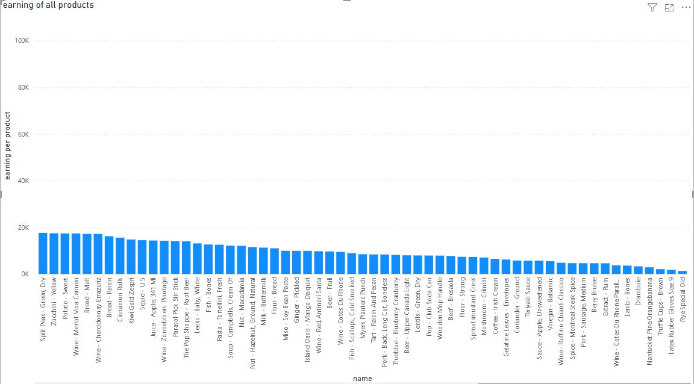
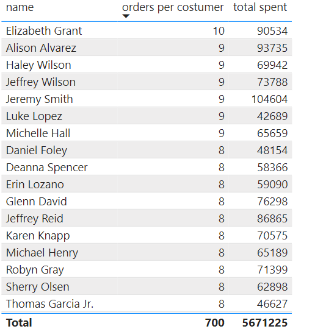
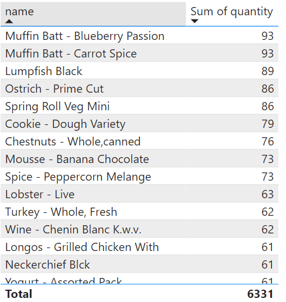
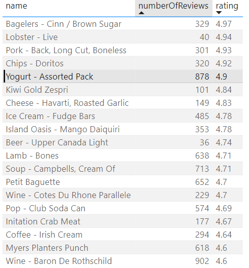

# Project 15: E-Commerce data pipeline

## Description
This project involves creating a data pipeline, extracting, transforming, and loading data into a warehouse, and then using Power BI for visualization. The data extracted via the API was insufficient as it was designed for a fake e-commerce website and lacked orders, users, etc. Therefore, I generated the missing data using libraries like Faker.

## Tools and Technologies
- Amazon Redshift
- Amazon s3
- Power BI
- SQL
- python

## Data model
Here is the data model used in this project:

## Setup Instructions
1. Clone the already transformed csv files.
2. Set up the Redshift database and load the prepared data.

## Usage Instructions
1. Connect to the Redshift database.
2. copy the prepared data into redshift
3. Run the SQL scripts in the `queries` folder to perform the analysis.
4. Open the Power BI file to view visualizations or see pictures below.

## Summary of Insights

### Sales Trends
- **Total Sales by Month**: Sales vary month-to-month with the highest in August 2002.
  
- **Total Sales by Product**: The highest revenue was from Spring Roll Veg Mini.
   

### Customer Behavior
- **Total Orders and Spending**: Jeremy Smith spent the most overall, while Alison Alvarez made the most orders.
  

### Product Performance
- **Top 10 Products by Quantity Sold**: Muffin Batt - Blueberry Passion and Muffin Batt - Carrot Spice were top sellers.
  
- **Product Ratings**: Bagelers - Cinn/Brown Sugar had the highest rating.
  

## Limitations of Data
This analysis is based on randomly generated data, which may not accurately reflect real-world scenarios. The insights derived are purely for demonstration purposes and may not provide meaningful business insights.

## Conclusion
This project showcases the integration of data engineering, API usage, and business intelligence to derive insights from e-commerce data. Key steps - Data extraction, Data generation,
data transformation, data loading, data analysis, data visualization.
By following these steps, I demonstrated the end-to-end process of setting up a data pipeline, from data extraction to visualization. This workflow is essential for modern data engineering and business intelligence, providing actionable insights that can drive strategic decisions in e-commerce.
